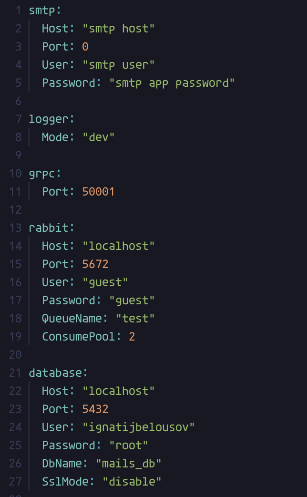

# KIP-EmailService
This is a service for sending emails through gRPC interface 

## Setup
First u need smtp credentials for [gomail](https://github.com/go-gomail/gomail), u can obtain it from various providers, for example [yahoo](https://help.yahoo.com/kb/SLN4724.html).

## Example config
 

You can also find example config template inside config/ folder

## Running
For running you need a CONFIG variable setted in env, for testing purposes you can edit values in config/config-local.yml and then export it with following command
```bash
export CONFIG=$(cat config/config-local.yml)
```

Local run
```bash
make run
```

## Todo
- [ ] Logs exporting
- [ ] Docs
- [ ] Helm chart
- [ ] Alertmanager & Prometheus 
- [ ] Tracer
- [ ] CI/CD and scripts
- [x] Grpc server & repository tests
- [x] Editor config
- [ ] Remove rabbitmq
- [ ] Logger mode
